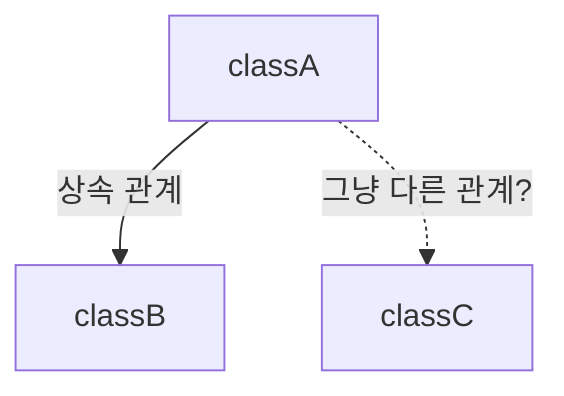
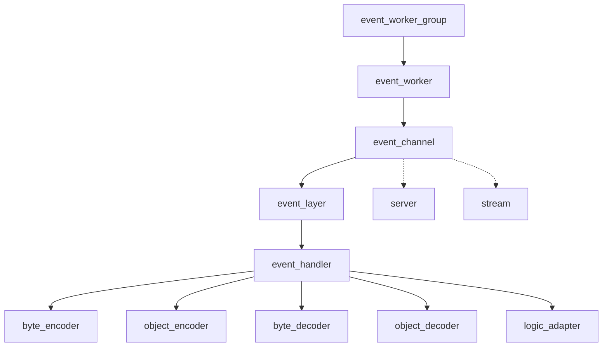

### 그래프 읽는 법

```mermaid
graph TD
classA --상속 관계--> classB
classA -.그냥 다른 관계?.->classC
```

# event classes hierarchy

```mermaid
graph TD
A[event_worker_group]
B[event_worker]
C[event_channel]
D[event_layer]
E[event_handler]
F[byte_encoder]
G[object_encoder]
H[byte_decoder]
I[object_decoder]
J[logic_adapter]

A --> B
B --> C
C --> D
C -.-> server
C -.-> stream
D --> E
E --> F
E --> G
E --> H
E --> I
E --> J

class A,B,C,D,E,F,G,H,I,J,K,L,M,N,O,P,Q,R,S,T,U,V,W,X,Y,Z internal-link;
```
