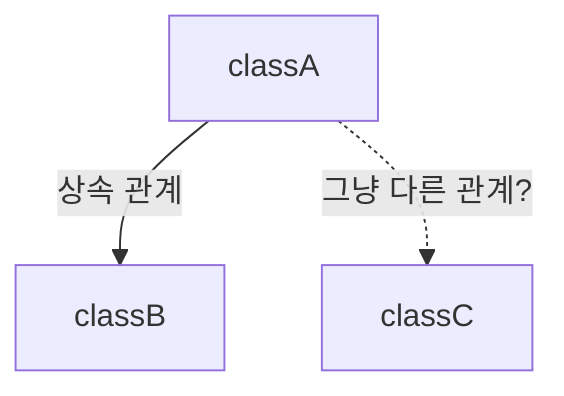
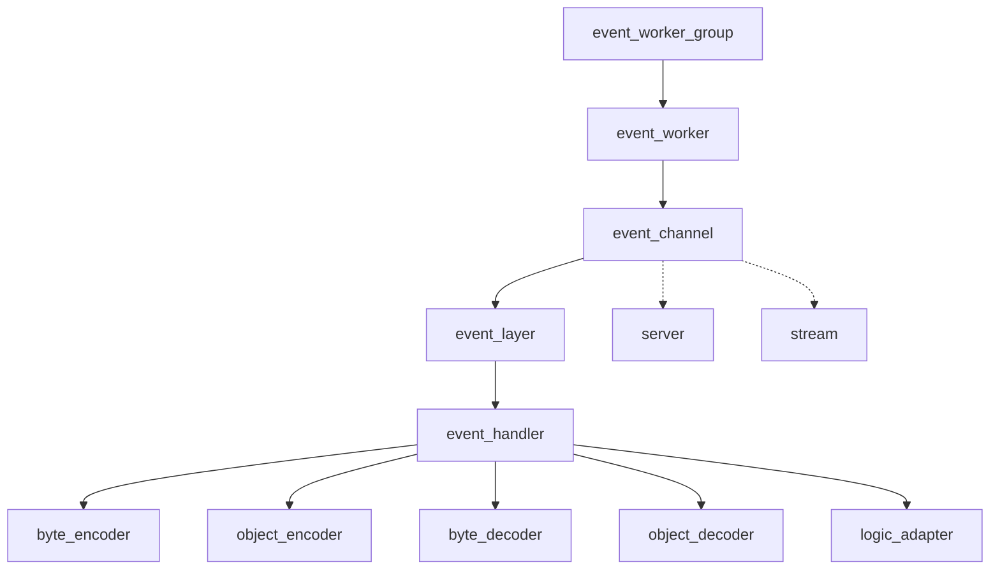
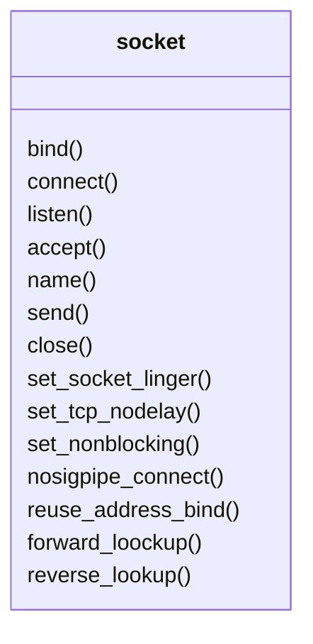
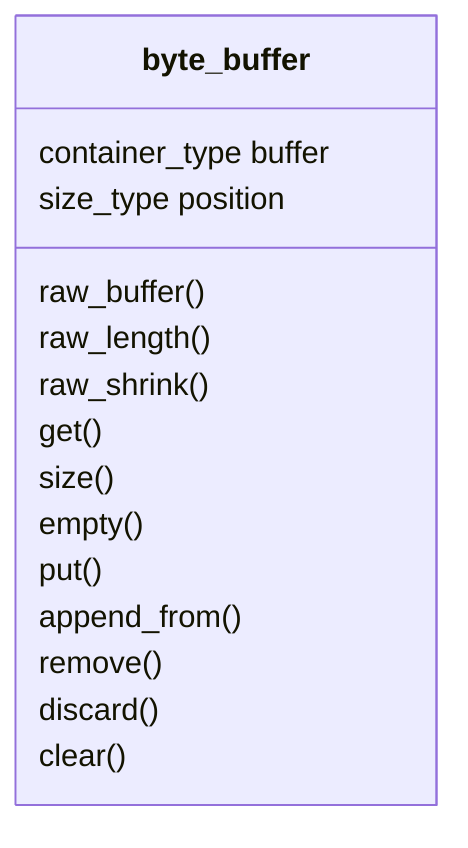
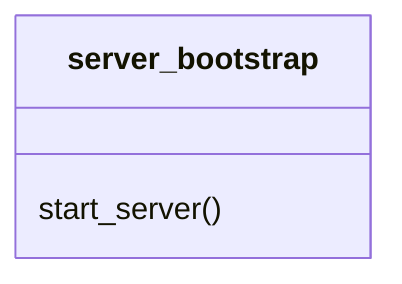
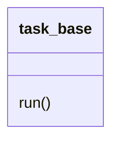

### 그래프 읽는 법

# event classes hierarchy

---
# other util classes

## socket utils

- forward_lookup: 

### byte_buffer

### server_bootstrap

start_server:
bind,  set_nonblock,  listen,  name socket.

### task_base

FT_SERV_DEFINE_TASK(name, T`N`, a`N` expr)
make class with name, has only member function run()
run() will do `expr` with each of type TN of argument aN

Flow of utils
